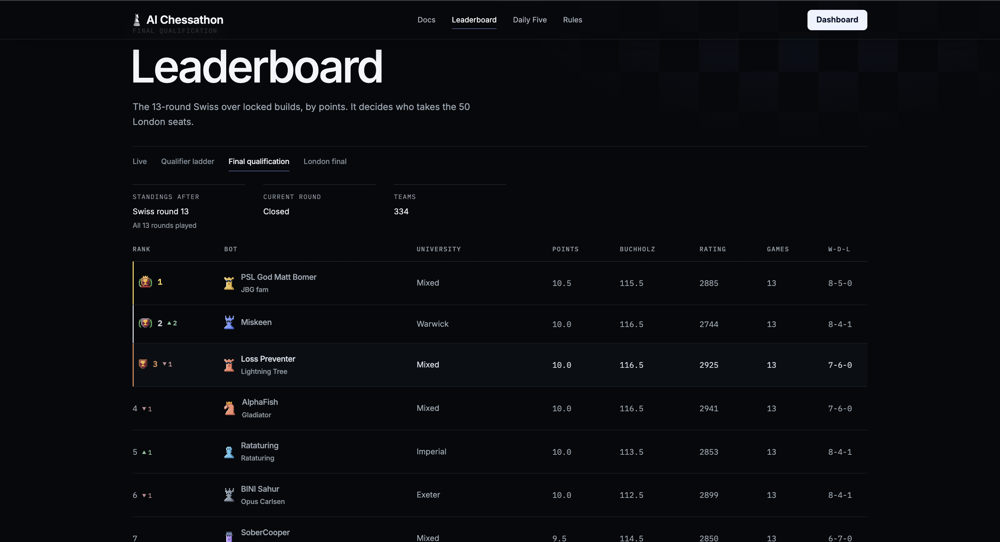
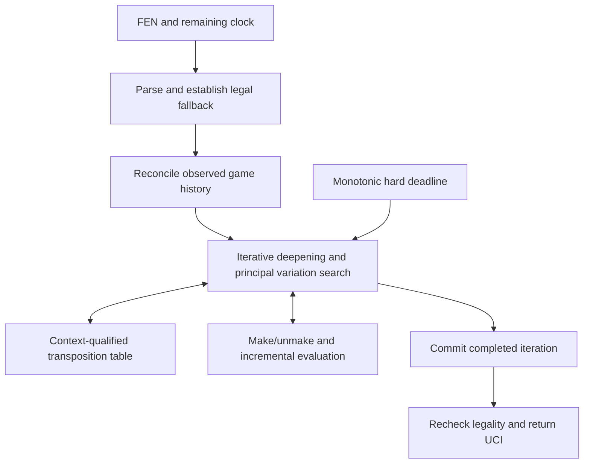

# Miskeen · مسكين

**2nd of 334 teams in the AI Chessathon Final Qualification · 10/13 points · University of Warwick**

A Python/Numba chess engine combining **principal variation search, incremental integer neural evaluation and explicit runtime resource management**. The repository includes a runnable baseline, a CPU training pipeline, versioned model exports, differential correctness tests and reproducible benchmarks.

The engineering focus is the interaction between model accuracy and execution cost: search selectivity, memory layout, cache reuse, quantization, cancellation and reproducible evaluation under a fixed clock.

[Architecture](#technical-overview) · [Quickstart](#install-and-choose-a-move) · [Training](#train-your-own-evaluator) · [Verification](#verify-and-measure)

## Competition result

Miskeen finished **second in the AI Chessathon Final Qualification**, the completed 13-round Swiss that selected participants for the London final.

| Final qualification standing | Result |
|---|---:|
| Rank | **2 / 334 teams** |
| Points | **10.0 / 13** |
| Wins / draws / losses | **8 / 4 / 1** |
| Buchholz | **116.5** |
| University | **Warwick** |



*Original leaderboard screenshot supplied by the author, after all 13 Final Qualification rounds. The result belongs to Miskeen’s competition entry; this public engineering and training reference excludes its locked tournament checkpoint.*

## Technical overview

The engine combines iterative-deepening principal variation search with a sparse, incrementally updated integer evaluator. Python provides an inspectable reference path; Numba kernels provide a separate compiled search backend and optimized evaluation. The runnable root adapter uses a classical material/piece-square evaluator, so a fresh clone can choose moves immediately without a model download.

| Systems problem | Design | Implementation |
|---|---|---|
| Deadline-constrained decision making | Soft iteration budgets, monotonic hard deadlines, legal fallback, completed-iteration commit | [`search.py`](engine/search.py), [`clock.py`](engine/clock.py) |
| Stateful computation with cancellation | Reversible board updates and transactional evaluator push/pop | [`board.py`](engine/board.py), [`evaluate.py`](engine/evaluate.py) |
| Path-dependent value | Separate geometric identity, rule counters, repetition history and model/utility context | [`state.py`](engine/state.py), [`tt.py`](engine/tt.py) |
| Batch-one inference cost | Shared 512-channel sparse transform, incremental deltas and perspective refreshes | [`features.py`](engine/features.py), [`evaluate.py`](engine/evaluate.py) |
| Exact deployment semantics | Quantization-aware forward arithmetic, explicit widening, clipping and floor shifts | [`model.py`](training/model.py), [`int_eval.py`](training/int_eval.py) |
| Artifact size and loading peaks | Signed 9/7/6-bit packing, bounded chunked decoding, versioned hash-checked containers | [`model_io.py`](engine/model_io.py) |
| Statistical leakage and label ambiguity | Grouped splits, canonical board keys, provenance, bounds and censoring semantics | [`splits.py`](training/splits.py), [`labels.py`](training/labels.py) |
| Reproducible measurement | Fixed positions, fresh transposition tables, source fingerprints and per-sample metadata | [`bench/run.py`](bench/run.py) |

The optimization target is **expected game score under the complete runtime budget**. Evaluation accuracy affects the quality of leaf estimates; inference cost affects how many useful branches can be searched; selectivity and move ordering determine where that work is spent. Experiments therefore need both statistical controls over the position distribution and operational measurements of the complete engine.

### Search and state



The search implements aspiration windows, quiescence, history-based ordering, late-move reductions, null-move pruning and verification mechanisms. These selective estimates remain heuristics. A reduced search does not become an exact minimax bound merely because its static evaluation is confident.

Three details matter at the systems boundary:

- **Cancellation is transactional.** An interrupted iteration must restore board and evaluator state without replacing the last completed principal variation.
- **Position equality is insufficient for score reuse.** A legal transposition-table move hint can remain useful when repetition history or draw counters invalidate its cached score.
- **Missing history remains unknown.** The interface supplies FEN observations rather than a complete game record. The engine reconciles legal endpoints and represents an unknown prefix explicitly; it does not invent repetition evidence.

Null moves belong to the search tree, not to played history. Mate scores, legal-game plies and the absolute game horizon are handled separately.

### Transposition-table layout and reuse semantics

The transposition table packs each entry into **two 64-bit words** and groups four entries into a **64-byte cluster**. At a 128 MiB table allocation, this provides 8,388,608 entry slots; the public baseline and README examples use smaller 8 MiB tables.

| Packed field group | Information retained |
|---|---|
| Identity and ordering | 32-bit position tag, 15-bit move, search depth, bound type and generation |
| Search evidence | Signed 16-bit search score and raw static evaluation |
| Value context | Halfmove clock, horizon band, model version and utility version |
| Repetition context | Repetition-count band and unknown-history-prefix flag |

Probe logic separates **move ordering**, **raw evaluation reuse** and **score cutoffs**. A stored lower or upper bound is useful for pruning only when depth, search window and context checks permit it. Mate scores are normalized on storage and adjusted for the probing ply. Online correction history is applied to the raw evaluation by the searcher rather than permanently folded into the cached value.

Production reuse uses declared approximations, including repetition and horizon bands. The separate `StrictTable` audit oracle keys scores by exact counters and a fingerprint of the complete known reversible history. Counterfactual-history tests compare those policies on positions with identical geometry but different draw implications. See [`engine/tt.py`](engine/tt.py) and [`tests/test_tt.py`](tests/test_tt.py).

### Compiled execution and memory layout

The compiled backend represents mutable state as fixed-offset regions in preallocated, dtype-specific NumPy arrays:

```text
ctx = (uint64, int64, int32, int16, int8, uint8, uint32, transposition_table)
          │
          └─ board state · per-ply moves · search stack · histories
             accumulator stack · model tables · clock state
```

Move buffers and search stacks are addressed by ply and offset, keeping Python objects out of the recursive Numba hot path. Weight regions sit at the ends of their arrays so earlier offsets remain constant across configurations. Since array length is not part of Numba's array type, the context can retain the same type signature for classical and neural evaluation configurations.

The native monotonic-clock bridge lets compiled search poll a hard deadline without returning to the Python driver at every node. Each backend keeps deadline arithmetic within its own clock domain. Poll frequency and unwind margins determine stopping latency, while the soft allocator decides whether to start another iteration.

Compilation and cache loading are tested as distinct lifecycle events. A two-process regression first builds a fresh cache and then loads it in another process, exercising recursive search specializations and node-limit aborts. This catches unresolved compiled-call references that a same-process smoke test would miss. See [`layout.py`](engine/kernels/layout.py), [`nclock.py`](engine/kernels/nclock.py) and the [cache regression](tests/test_kernels_segload.py).

### F512-EF-K12-16/32 evaluator

For each perspective, active piece-square, occupied-square threat and compact pawn-pair rows are added into the **same 512-channel accumulator before nonlinear interaction**.

| Feature family | Rows | Channels | Runtime coefficient type | Packed width |
|---|---:|---:|---|---:|
| King-relative piece-square | 9,216 | 512 | `int16` | 9 bits |
| Filtered occupied-square threats | 59,808 | 512 | `int8` | 7 bits |
| Compact pawn pairs | 1,488 | 512 | `int8` | 6 bits |

The transform uses **12 non-uniform king buckets** and two normalized perspectives. Piece changes update active rows; a king-frame change refreshes the affected perspective. The schema bounds accumulator magnitude by **30,048** under its coefficient and active-feature limits.

```text
Two perspective accumulators: int16[512]
    │ split into two 256-channel halves
    │ clip each operand to [0, 255], widen, multiply, shift right by 9
    ▼
256 activations per perspective, concatenated as side-to-move then opponent
    ▼
512 → 16 affine → 32 linear/squared activations
    ▼
 32 → 32 affine → 64 linear/squared activations
    ▼
Concatenate 32 + 64 → 96 → scalar value + auxiliary W/D/L logits
    + incrementally accumulated piece-square linear skip
```

One of eight heads is selected by `min(7, max(0, (piece_count - 2) // 4))`. The scalar head path requires **9,312 dense multiply-accumulates**, excluding feature maintenance and the skip path. It need not compute WDL logits at every leaf.

Arithmetic is part of the model specification. For a hidden affine output `z`, let `x = z >> 6`; the branches are `clip(x, 0, 127)` and `clip((x*x) >> 7, 0, 127)`. The square is taken **before clipping x**, including for negative x. Widening and arithmetic right shifts must agree across training, scalar reference and compiled runtime.

The packed numerical payload is **32,900,768 bytes**, before container metadata and engine source. Packed storage, decoded arrays and initialization peak RSS are separate budgets. See the [machine-readable contract](spec/RX_FINAL_PLAN/architecture.json) and [architecture notes](docs/architecture.md).

### Incremental evaluation and export integrity

For perspective `p`, the feature transform is a sparse sum:

```text
a_p = bias + Σ W_psq[row] + Σ W_threat[row] + Σ W_pawn_pair[row]
```

A full refresh costs work proportional to the number of active rows times the 512-channel width. Incremental updates instead apply removed and added rows, with cost proportional to the changed feature set. Captures, promotions, castling and en passant require their corresponding geometry changes; king-frame transitions require perspective refreshes. Push/pop state ties accumulator lifetime to reversible board updates.

RXF1 stores a little-endian header, bounded JSON metadata and ordered coefficient sections. Signed fields use two's-complement packing with explicit bit order and terminal padding. A SHA-256 digest covers metadata and payload; the loader also validates dimensions, coefficient ranges and format identity. Decoding proceeds in bounded chunks so temporary unpacking arrays do not scale to the entire model payload at once.

The verification chain compares the quantized training forward pass, scalar integer reference, serialized export and Numba runtime. It tests exact outputs rather than a floating-point tolerance that could conceal rounding or activation-order differences. The [packing oracle](spec/RX_FINAL_PLAN/signed_packing_reference.py) provides an independent scalar implementation for codec comparisons.

## Install and choose a move

Use **CPython 3.12**. From the repository root:

```sh
uv sync --locked --extra dev
```

Alternatively:

```sh
python3.12 -m venv .venv
.venv/bin/python -m pip install -e '.[dev]'
```

The locked environment includes NumPy, Numba, python-chess and development tools. The reference trainer runs on CPU using NumPy; PyTorch, a GPU and cloud credentials are not required.

```sh
.venv/bin/python - <<'PY'
import chess
from agent import get_move

board = chess.Board()
move = get_move(board.fen(), time_left_ms=1_000)
assert chess.Move.from_uci(move) in board.legal_moves
print(move)
PY
```

The adapter owns mutable state for **one game**. Use a fresh process per game and serial calls. It returns a UCI move, or `0000` when no legal move exists; invalid positions raise `ValueError`. The default baseline is separate from the neural runtime and from the competition checkpoint.

## Train your own evaluator

The source includes an executable reference pipeline:

```text
PGNs or typed teacher observations
    → validated records and immutable hashed shards
    → deduplication and grouped split assignment
    → sparse feature encoding
    → quantization-aware optimization
    → atomic checkpoints
    → RXF1 integer export
    → runtime load and parity checks
```

### 1. Build a training shard

The bundled PGNs are small parser/training fixtures suitable for checking the workflow. Replace `training/testdata` with a directory of your own appropriately licensed PGNs for an actual experiment. Completed PGNs provide **game-outcome supervision**, not searched centipawn or action-value labels.

```sh
.venv/bin/python - <<'PY'
from pathlib import Path
from training.extract_pgn import extract_pgn_file
from training.feature_spec import SPEC
from training.records import write_shard
from training.splits import assign_splits, assert_no_leakage

input_dir = Path("training/testdata")
records = []
for path in sorted(input_dir.glob("*.pgn")):
    records.extend(extract_pgn_file(str(path), corpus=path.stem))
if not records:
    raise ValueError("No PGN positions found")

splits = assign_splits(records)
assert_no_leakage(splits.kept)
counts = {name: sum(r["split"] == name for r in splits.kept)
          for name in ("train", "development", "sealed", "quarantine")}
print("Split counts:", counts)
if not counts["train"]:
    raise ValueError("No training cluster; supply more independent games")

manifest = write_shard(
    "models/demo-shard", records,
    shard_id="demo-pgn-v1", feature_schema_id=SPEC.schema_id,
)
print("Records:", manifest["record_count"])
print("Payload SHA-256:", manifest["payload_sha256"])
PY
```

Shard directories are immutable: use a new name to ingest a new dataset. Splits operate on connected groups of related observations, games and positions. Highly overlapping games can collapse into a single group; an empty development partition must not be presented as a held-out evaluation.

### 2. Run a small training job

```sh
.venv/bin/python -m training.train models/demo-shard \
  --out models/miskeen-demo --epochs 2 --batch 256 --lr 0.1
```

This is a workflow demonstration, not a reproduction of the tournament model. Increase the dataset and training budget only after inspecting data quality, split coverage and exported evaluation behaviour. Training loads records, feature caches, parameters and optimizer state into memory; its memory requirement is separate from the deployed engine's 2 GB limit. The retained implementation is a CPU reference trainer, not a streaming or distributed training service.

Allow at least **2 GB of free disk space for this small demo**. A checkpoint stores floating-point parameters and optimizer moments and can be hundreds of MiB; longer runs accumulate multiple checkpoints. The roughly 33 MB integer export is much smaller than the training state.

The trainer writes checkpoints under `models/miskeen-demo/checkpoints/` and a raw RXF1 export at `models/miskeen-demo/pilot.rxf1`. Repeating the command resumes the latest checkpoint in that output directory. Keep the dataset and configuration unchanged when resuming; use a new output directory for a different experiment. `--epochs` specifies the total target epochs, not extra epochs to append.

The reference forward pass quantizes folded coefficients during optimization and uses straight-through gradients. Losses can combine scalar value, WDL, game outcome, bound-aware supervision and consistency; action-regret terms require suitable action-labelled data. The CLI prints training loss. Development records are partitioned, but this CLI does **not** compute a held-out score or playing-strength estimate.

### 3. Load the exported model

The runtime accepts raw RXF1 **bytes**. A path passed directly to `init` uses the separate NumPy-container loader, so read a raw `.rxf1` file explicitly:

```sh
.venv/bin/python - <<'PY'
from pathlib import Path
import chess
from engine import agent_rx

# Load and warm before starting the move clock.
agent_rx.init(Path("models/miskeen-demo/pilot.rxf1").read_bytes(), tt_mib=8)
board = chess.Board()
move = agent_rx.get_move(board.fen(), 1_000)
assert chess.Move.from_uci(move) in board.legal_moves
print(move)
PY
```

For richer training data, use the [typed record schema](spec/RX_FINAL_PLAN/training_schema.json) and [record constructors](training/records.py). Preserve teacher identity, source hashes, score perspective, bound type, termination and censoring. A fail-high bound is not a point label; a skipped relabel is not a win; a child's side-to-move score needs conversion before it represents the parent's action value.

## Verify and measure

```sh
make lint       # static checks and formatting
make test       # default correctness and numerical regression suite
make benchmark  # fixed-depth classical search; structured JSON output
make test-deep  # extended perft and randomized stress checks; potentially hours
```

Tests cover differential move generation against python-chess, reversible state, repetition and draw boundaries, abort-safe commits, integer parity, packed-container corruption, split leakage and checkpoint/export behaviour. The compiled-cache regression uses separate processes to catch failures that appear only after loading cached machine code.

The benchmark records source revision and SHA-256, dependency versions, platform, evaluator/backend configuration, nodes, elapsed time and individual samples. It uses fixed positions and a fresh 8 MiB transposition table per sample. It excludes initialization and model loading; its local timings are not an EPYC qualification result or an Elo estimate.

See [verification methodology and recorded local checks](docs/verification.md). CI uses a locked Python environment, pinned action revisions, lint, default tests, package builds and an installed-wheel smoke check outside the source checkout.

## Repository map

```text
agent.py                  weights-free, single-game reference adapter
engine/
  board.py, movegen.py     position representation and legal moves
  search.py, history.py   PVS, quiescence, selectivity and ordering
  state.py, tt.py          history, counters and context-qualified caching
  features.py             canonical feature encoders and deltas
  evaluate.py             integer inference and accumulator lifecycle
  model_io.py             RXF1 validation, packing and bounded decoding
  agent_rx.py             neural-runtime integration
  kernels/                compiled search, evaluation and clock bridge
  clock_b/                allocation and deadline utilities
training/                 records, splits, trainer, checkpoints and export
spec/RX_FINAL_PLAN/       evaluator/data contracts and scalar packing oracle
tests/                    differential, numerical and failure-path regressions
bench/                    reproducible local measurements
docs/                     architecture, verification and competition screenshot
```

## Deployment context and scope

The competition environment required one CPU core, 2 GB RAM, no network or GPU, and at most 50,000,000 unpacked bytes, with a 120-second clock plus 0.5 seconds per legal move. The [competition documentation](https://aichessathon.com/docs), checked 12 September 2026, distinguishes 90-second qualifier initialization from 30-second final initialization. This public source release has not been requalified against the final initialization budget.

Tournament checkpoints, private datasets, provider administration and historical experiment archives are excluded. The qualification result belongs to Miskeen's competition entry; new models trained from this repository must establish their own strength through controlled, paired-colour games and complete-package resource checks.

## About the name

*Miskeen* takes its name from Arabic [*miskīn* (مسكين)](https://www.arabicacademy.gov.eg/ar/محرك-البحث/معجم/dic-19/المسكين). It is a small nod to the project's beginnings without large-scale compute, and the emphasis that followed: efficient algorithms, careful measurement and making the most of the available hardware.

> “We must make the best use that we can of the things which are in our power…”
>
> — Epictetus, [*Discourses*, Book I, Chapter 1](https://classics.mit.edu/Epictetus/discourses.1.one.html), excerpt

## Licence and attribution

GPL-3.0-or-later. See [LICENSE](LICENSE), [third-party notices](THIRD_PARTY_NOTICES.md) and [contribution guidelines](CONTRIBUTING.md). Component provenance is retained, and no upstream pretrained chess network is distributed.
