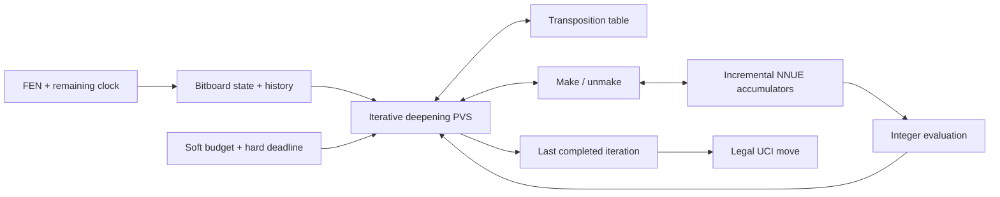

# Miskeen | AI Chessathon

[](https://github.com/TahaKhanM/AIChessathon/actions/workflows/ci.yml)

**2nd out of 314+ teams in the Global AI Chessathon Final Qualification**

I built Miskeen for a simple question: how strong a chess engine could I make when the deployed agent gets one CPU core, 2 GB of RAM, no network, no GPU and a 50 MB package limit?

The answer ended up being much more of a systems problem than a model-size problem. By v4, Miskeen combined a custom Numba-compiled bitboard engine, selective principal variation search, an incrementally updated NNUE-style evaluator that I trained from scratch, and a training and evaluation pipeline built around the actual competition clock.

The part I found most interesting was the trade-off between **decision quality and cost**. A better evaluator is not better if it makes search too slow. A pruning rule is not useful if it saves nodes by deleting the wrong branch. A model that looks better offline is not a stronger chess engine until the complete packaged agent wins under the real runtime constraints.

This repository is the cleaned public release of that work. The tournament checkpoint, private training data and historical match outputs are intentionally not included.

## At a glance

| Area | v4 approach |
|---|---|
| Search | Iterative-deepening PVS / alpha-beta with aspiration, quiescence, transposition-table reuse and selective pruning |
| State | Custom bitboards, reversible make/unmake, repetition and draw context, legal root fallback |
| Evaluation | Dual-perspective sparse NNUE, 16 king buckets, SCReLU hidden layer, piece-count output buckets |
| Runtime | Numba hot path, preallocated NumPy storage, incremental integer accumulators, explicit deadline handling |
| Training | Own teacher-labelled positions + public Lichess evaluations, quantization-aware training and held-out splits |
| Validation | Paired full-engine games at the competition clock, target-CPU checks and package-level qualification |

## Why the constraints mattered

The competition runtime was deliberately tight:

- one AMD EPYC CPU core
- 2 GB RAM
- no network and no GPU during play
- Python 3.12 with NumPy and Numba available
- 50 MB maximum unpacked submission
- 120 seconds plus 0.5 seconds per move

That changes how you design the engine. I could not treat search, inference, memory layout and time management as separate problems. Every feature had to earn the CPU time and bytes it consumed.

For me, that was the core of the project: **optimising expected playing strength per unit of runtime rather than optimising any single benchmark in isolation.**

## v4 architecture

During the final development window, the stable v4 line used a K16 NNUE with a direct H1024 SCReLU head on top of the search engine. The exact locked tournament checkpoint is not distributed here, but the architecture and development process are described below.



### Search

The searcher is an iterative-deepening principal variation search built on alpha-beta. Quiescence handles unstable tactical leaves, while aspiration windows and move ordering try to make the useful branch fail high as early as possible.

The competition-era search also used a selective stack around that core, including transposition-table cutoffs and static-eval reuse, verified null-move pruning, reverse futility and razoring, internal iterative reduction, late-move reductions and pruning, static exchange evaluation, history-based ordering and a small number of targeted extensions.

I deliberately treated these as heuristics rather than correctness rules. Reduced searches can be wrong. Cached scores can become unsafe when draw context changes. Null moves belong to the search tree, not the played game history. The engine therefore separates move-ordering hints from score reuse and keeps enough game context to avoid treating every geometrically identical board as equivalent.

The other non-negotiable part was cancellation. Before expensive work starts, the engine already has a legal fallback. It only publishes a principal variation from a fully completed iteration. If the hard deadline fires halfway through the next depth, board state and evaluator state unwind together and the previous result survives.

The public reference implementation lives in [`engine/search.py`](engine/search.py), [`engine/state.py`](engine/state.py), [`engine/tt.py`](engine/tt.py) and [`engine/board.py`](engine/board.py).

### NNUE evaluation

The v4 evaluator was designed for the workload a chess search actually creates: batch size one, millions of closely related positions and a very small latency budget per leaf.

For each perspective, the network used **16 king buckets × 768 piece-square features**, giving a sparse 12,288-row feature space. Active rows were accumulated into a hidden layer and updated incrementally as moves were made and unmade rather than rebuilt from scratch at every node.

The v4 line used:

```text
sparse king-relative piece-square features
        ↓
white and black perspective accumulators
        ↓
H1024 SCReLU hidden transform
        ↓
8 piece-count / material output buckets
        ↓
integer scalar evaluation
```

Weights and accumulators were integer-valued at runtime, with widened reductions where needed. The point was not simply to make the network small. It was to make the network cheap enough that better positional information still translated into useful search depth.

One of the most useful performance lessons came from something much less glamorous than the model architecture. A multidimensional indexing pattern in the neural hot loop stopped LLVM from vectorising the dot product effectively on the target EPYC. Reworking the same computation around contiguous one-dimensional row views removed that bottleneck without changing the model at all. That kind of profiling-driven change became a recurring theme in v4.

The public tree now contains a later experimental integer evaluator under [`engine/evaluate.py`](engine/evaluate.py) and [`spec/RX_FINAL_PLAN/`](spec/RX_FINAL_PLAN/). **That F512/K12 design is post-competition research and should not be confused with the K16 v4 network described above.**

### Training pipeline

I trained the shipped network rather than starting from public pretrained chess weights.

The v4 data pipeline mixed two useful distributions:

- positions generated offline and labelled by a strong teacher engine
- the public CC0 Lichess evaluation database, which added deeper evaluations from human-game positions

By the later v4 experiments the pipeline was operating at roughly billion-record scale. Data generation, conversion, training and match evaluation ran as separate stages so I could change one variable without silently changing the rest of the experiment.

The training loop moved from floating-point optimisation into a quantization-aware phase before export. The important contract was not just low training loss. The quantized training forward pass, exported coefficients and integer runtime had to agree on clipping, widening, shifts and activation order.

I also kept provenance and split identity with the records. Positions from the same underlying source or parent group were kept together where needed so that validation did not become a disguised duplicate of training.

The cleaned public pipeline is under [`training/`](training/). It is intentionally a reference implementation rather than a copy of the private competition training corpus.

### Time and memory management

Time control affected search policy directly. A soft allocator estimated whether another iteration was worth starting, while a monotonic hard deadline existed to guarantee enough time to unwind and return a legal move.

The Numba backend stores recursive state in fixed-layout typed arrays instead of Python objects in the hot path. Move buffers, search stacks, histories, transposition-table storage and evaluator state are allocated ahead of time so runtime behaviour is much more predictable.

This was also why I tested the complete package rather than just functions in isolation. Import time, JIT compilation, model loading, resident memory and worst-case stopping latency all count when the referee can lose the game for a timeout, crash or illegal move.

See [`engine/kernels/`](engine/kernels/) and [`engine/clock_b/`](engine/clock_b/) for the public runtime work.

## How I got to v4

v4 was not built by adding every chess-engine technique I could find. It came from repeatedly freezing a working baseline, changing one thing and then asking whether the whole engine was actually better.

### 1. Start with a correct engine

The early versions focused on bitboards, legal move generation, make/unmake, terminal rules and a classical evaluator. This gave me a trustworthy search harness before adding a neural model.

That order mattered. A faster evaluator cannot rescue broken repetition state, and a stronger search cannot rescue an engine that occasionally fails to restore its board after an interrupted branch.

### 2. Move the recursive hot path into Numba

Once the engine was correct enough to profile, Python overhead was the obvious constraint. I moved the search-critical data structures into typed NumPy arrays and compiled the recursive path with Numba.

I kept a slower reference path alongside it. That made it possible to compare optimised code against an independent implementation instead of debugging two moving targets at once.

### 3. Replace hand-written evaluation with a sparse neural model

The first neural versions proved that representation quality could repay some of the lost node rate, but they also exposed how expensive the wrong head architecture could be.

The v4 family simplified the dense path and put more capacity into a sparse H-sized transform. The direct SCReLU head was easier to make fast, easier to quantize and better matched to the single-position inference pattern of alpha-beta search.

### 4. Scale the data, not just the width

I built an offline generation pipeline, added public Lichess evaluations and trained multiple widths and schedules. A useful lesson was that apparently obvious upgrades were not automatically upgrades: making the network wider, training for longer or bolting on another standard search heuristic could improve a local metric without improving the complete engine.

The changes that survived were the ones that held up when search cost and data distribution were included in the experiment.

### 5. Make training and runtime agree exactly

Quantization initially created a gap between the model being optimised and the arithmetic being deployed. v4 introduced quantization-aware fine-tuning and explicit parity checks so I could reason about one model rather than a floating-point model and a slightly different integer one.

The same mindset applied to warm starts, clipping and export. If a resumed training run changed the incumbent simply by loading it, that was a bug, not a new experiment.

### 6. Promote whole engines, not isolated metrics

Every serious candidate eventually had to play through the real referee shape at the real clock, with colours paired and the source/model identity frozen. Static validation, nodes per second and microbenchmarks were diagnostic tools, not promotion criteria by themselves.

That discipline also meant rejecting work. Several changes that looked attractive in isolation were neutral or worse once the evaluator, search tree and clock interacted. Keeping the known-good build was often the right decision.

### 7. Freeze v4 and keep the research separate

Once v4 was stable, I kept it as a protected baseline while testing larger and more experimental successors. That separation is reflected in this public repository too: the later F512 evaluator and richer feature work are useful research, but they are not retroactively presented as the architecture that produced the competition result.

## Public release

A fresh clone is deliberately usable without downloading a checkpoint. [`agent.py`](agent.py) runs the classical reference evaluator, while [`engine/agent_rx.py`](engine/agent_rx.py) exposes the neural runtime when given an explicit model artifact.

The public repository includes:

- board representation, move generation, search and time management
- integer neural inference and incremental accumulator logic
- training records, splits, checkpointing and export code
- differential correctness and failure-path tests
- local benchmark tooling with environment metadata

It does **not** include tournament weights, private datasets, opening assets or historical playing-strength result files.

## Quickstart

Use CPython 3.12.

```sh
uv sync --locked --extra dev
```

Or:

```sh
python3.12 -m venv .venv
.venv/bin/python -m pip install -e '.[dev]'
```

Choose a move with the weights-free reference adapter:

```sh
.venv/bin/python - <<'PY'
import chess
from agent import get_move

board = chess.Board()
move = get_move(board.fen(), time_left_ms=1_000)
assert chess.Move.from_uci(move) in board.legal_moves
print(move)
PY
```

## Train the public reference evaluator

The bundled PGNs are small fixtures for exercising the pipeline, not tournament training data. Build your own appropriately licensed dataset shard and run:

```sh
.venv/bin/python -m training.train models/demo-shard \
  --out models/miskeen-demo --epochs 2 --batch 256 --lr 0.1
```

The full typed-record and model contracts live under [`spec/RX_FINAL_PLAN/`](spec/RX_FINAL_PLAN/).

## Verification

The repository keeps the test and benchmark machinery, not historical outputs.

```sh
make lint
make test
make benchmark
make test-deep
```

The suite covers move-generation agreement, reversible state, draw and repetition semantics, abort-safe search, integer evaluator parity, serialization, data-split leakage and compiled-cache loading.

Benchmarks are written locally with source and environment metadata. They are intended to compare changes on a controlled machine, not to act as public Elo claims.

See [`docs/architecture.md`](docs/architecture.md) and [`docs/verification.md`](docs/verification.md) for the deeper engineering notes.

## Repository map

```text
agent.py                 weights-free reference adapter
engine/
  board.py, movegen.py   board representation and legal moves
  search.py, history.py  PVS, quiescence, pruning and ordering
  state.py, tt.py        history, counters and cache semantics
  evaluate.py            integer evaluation and accumulator lifecycle
  agent_rx.py            neural runtime integration
  kernels/               Numba-compiled search and evaluation
  clock_b/               allocation and deadline handling
training/                records, splits, trainer, checkpoints and export
spec/RX_FINAL_PLAN/      post-competition evaluator and data contracts
tests/                   correctness and failure-path regressions
bench/                   local benchmark tooling
docs/                    architecture and verification notes
```

## Licence

GPL-3.0-or-later. See [LICENSE](LICENSE), [third-party notices](THIRD_PARTY_NOTICES.md) and [contribution guidelines](CONTRIBUTING.md).
