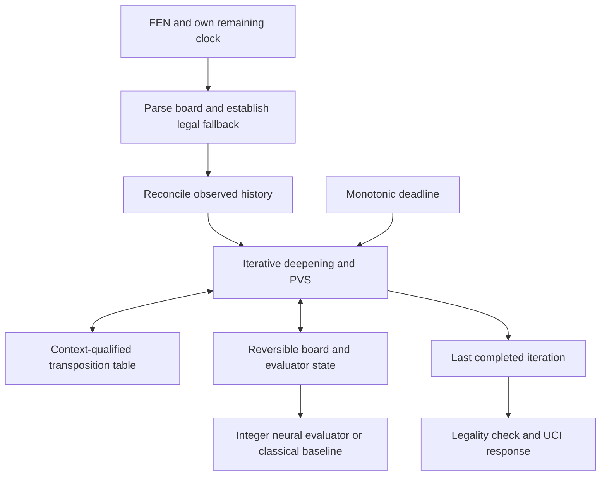

# Architecture and tradeoffs

The engine solves a bounded sequential decision problem. Every extra evaluation can improve move selection, but also consumes the clock needed to make future decisions. Correctness, latency and model quality must be measured together.

## Runtime boundaries

`agent.py` selects the classical reference path. `engine.agent_rx` integrates the neural evaluator with the Python search and accepts an explicit model artifact. `engine.kernels.driver.CompiledSearcher` is the separate compiled backend. These are distinct configurations; timing one does not establish the performance of the others.

## State is more than a board

Piece placement is insufficient for safe cache reuse. The engine tracks:

- Legal position identity: pieces, side to move, castling rights and relevant en passant state.
- Value context: rule counters, remaining absolute horizon, model and utility identity.
- Repetition context: known reversible history, hypothetical search path and an unknown-prefix marker.

The interface supplies observations rather than a complete move history. State reconciliation infers an opponent move only when legal endpoints match. Missing history stays unknown. A transposition-table move can remain useful for ordering even when its cached score is not reusable. Near-draw counterfactual tests exercise this distinction.

Null moves are search devices. They must not fabricate played repetition history or consume the legal-game horizon.

## Transactional search

Board make/unmake and evaluator push/pop form a transaction. Every exit path, including cancellation, must restore the root. An interrupted iteration cannot publish a partial principal variation over a previously completed result. The tests inject aborts and evaluator failures and compare restored state.

Search combines principal variation search, quiescence, aspiration windows and selective reductions. Selectivity is heuristic: an apparent cutoff after a reduced search can require a wider or deeper re-search. Static values are kept separate from mate scores and from online corrections.

The soft budget decides whether to begin another iteration. A monotonic hard deadline bounds work within the search, with margin for unwind and return. This is cooperative cancellation, not an operating-system real-time guarantee; scheduling and unchecked work still matter.

## Exact arithmetic and memory

The F512 evaluator sums piece-square, threat and pawn-pair rows into two perspective accumulators sharing a 512-channel transform. King-relative normalization permits compact row maps. Incremental updates avoid refreshing the full position after every move; changes to a king's frame force the affected perspective to refresh.

Clipping, widening, multiplication and shifts are part of the model contract. A mathematically similar floating-point expression is not sufficient. The test suite compares scalar and optimized arithmetic, special-move deltas and full refreshes.

Signed 9/7/6-bit storage compresses bounded coefficients without changing their values. Runtime arrays use native integer types. Therefore packed bytes, decoded resident memory and initialization peak memory are separate budgets. A SHA-256 check detects container corruption; it does not establish the trustworthiness of an artifact's publisher.

## Experimental discipline

The retained pipeline distinguishes point labels, bounds, mate labels, censored searches and skip sentinels. Position identity and split assignment help prevent duplicate boards from leaking across partitions. Quantization is represented during the reference forward pass and checked again after export.

A lower validation error is not evidence of a stronger engine. A model can improve static accuracy while reducing useful search depth. A credible strength comparison should freeze source and model hashes, pair colours on the same openings, hold out evaluation families, and report failures alongside game scores. This public release supplies correctness and local timing tools; it does not supply a fresh playing-strength study.

## Operational scope

The runtime needs no network, cloud account or training service. One process owns one game's mutable state. The source package contains no model weights, tablebases or opening book. Distribution builds include the frozen clock table explicitly, so installation does not depend on files left in a development checkout.
